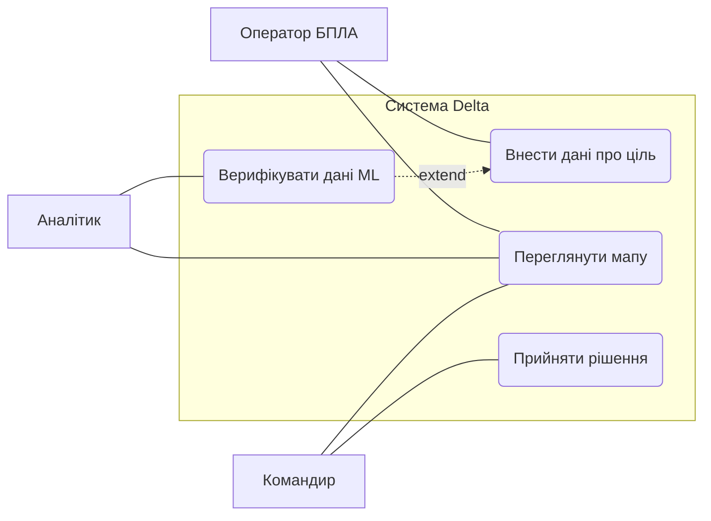
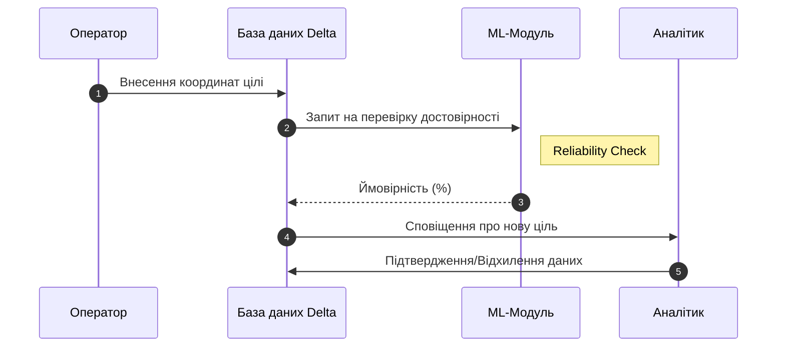
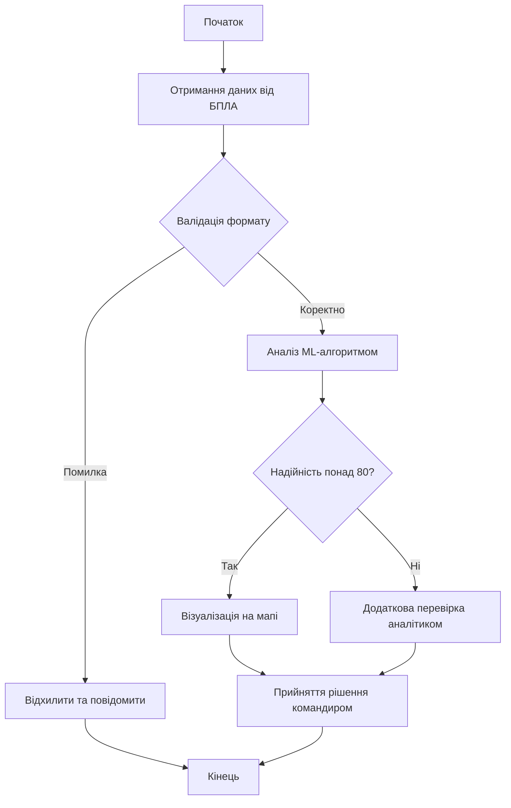

# Практична робота: Побудова поведінкових UML-діаграм

**Предметна область:** Система ситуаційної обізнаності «Delta»  
**Виконав:** Курсант Шмиголь Олександра

---

## 1. Діаграма варіантів використання (Use Case Diagram)

**Призначення:** опис функціональних вимог до системи та взаємодії акторів.
# Практична робота: Побудова поведінкових UML-діаграм
**Предметна область:** Система ситуаційної обізнаності «Delta»
**Виконав:** Курсант Шмиголь Олександра

---

## 1. Діаграма варіантів використання (Use Case Diagram)

---

## 2. Діаграма послідовності (Sequence Diagram)

---

## 3. Діаграма діяльності (Activity Diagram)

